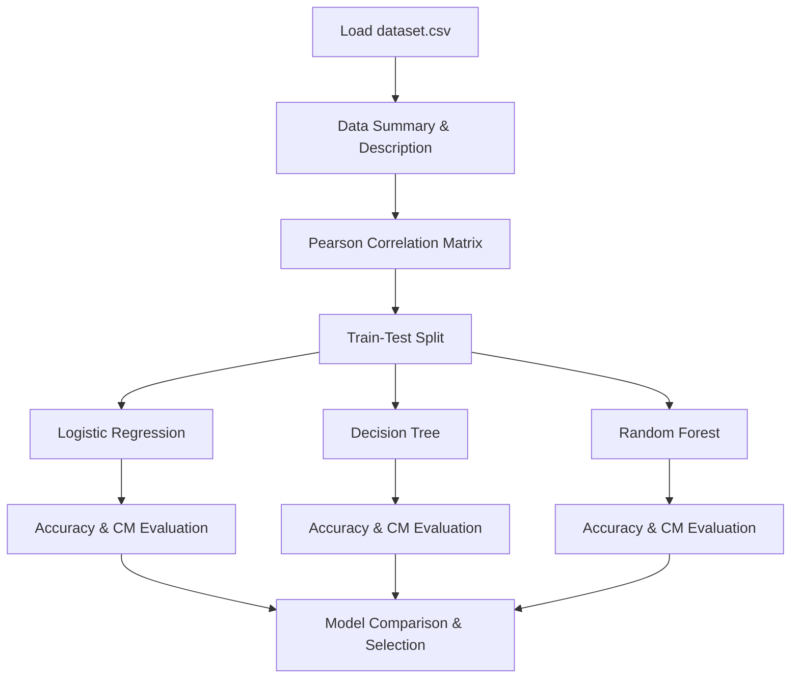

# Heart Disease Prediction: Multi-Model Evaluation

[](https://www.python.org/)
[](https://scikit-learn.org/)
[](https://pandas.pydata.org/)

A comparative study implementing and benchmarking multiple machine learning classifiers to predict heart disease diagnosis from patient clinical records.

---

## 📌 Project Overview
This project assesses patient attributes (age, chest pain type, blood pressure, cholesterol, ECG, max heart rate, etc.) to predict cardiovascular risks. The notebook performs extensive exploratory correlation analysis and then evaluates three classifiers to select the best performer.



---

## 📐 Mathematical Formulation

### Pearson Correlation Coefficient
Before modeling, correlations between patient features are determined using:

$$\rho_{X,Y} = \frac{\text{cov}(X,Y)}{\sigma_X \sigma_Y}$$

Where:
- $\text{cov}(X,Y)$ is the covariance between features $X$ and $Y$.
- $\sigma_X, \sigma_Y$ are the standard deviations of $X$ and $Y$ respectively.

---

## 📊 Model Benchmarking Setup
The project trains and compares three distinct classifiers:

| Classifier | Highlights | Performance Evaluation |
| :--- | :--- | :--- |
| **Logistic Regression** | Fits a linear decision boundary using log-odds | Accuracy & Confusion Matrix |
| **Decision Tree** | Hierarchical partition based on informational criteria | Accuracy & Confusion Matrix |
| **Random Forest** | Ensemble of bootstrap-aggregated trees | Accuracy & Confusion Matrix |

---

## 🛠️ Requirements & Installation
Install dependencies:
```bash
pip install numpy pandas matplotlib seaborn scikit-learn
```

---

## 🚀 How to Run
1. Place `dataset.csv` (heart disease records) in the project directory.
2. Open and run `Project(Predicting Heart Disease).ipynb`.
