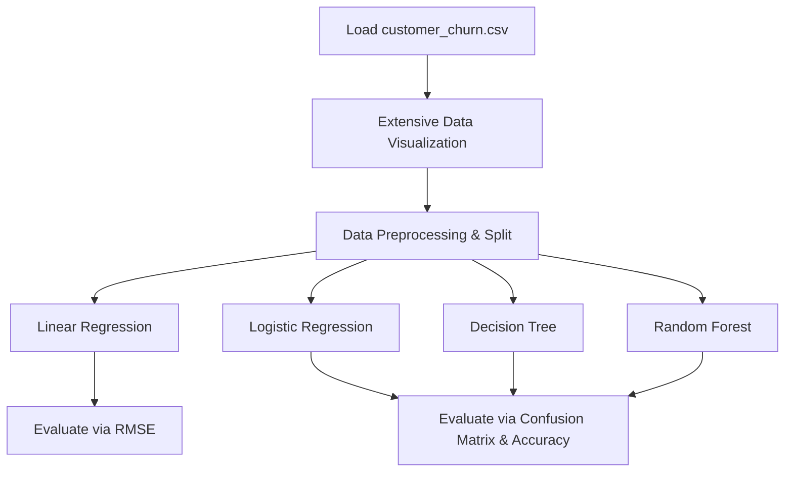

# Customer Churn Prediction: Regression & Classification

[](https://www.python.org/)
[](https://scikit-learn.org/)
[](https://pandas.pydata.org/)

An extensive, 90+ cell data science project modeling customer churn using a combination of data visualization, linear regression (for numerical forecasting), and multiple classification models.

---

## 📌 Project Overview
This project investigates customer retention patterns using the `customer_churn.csv` dataset. The notebook implements a dual-mode predictive system:
1. **Numerical Regression**: Estimating billing or tenure attributes.
2. **Binary Classification**: Estimating likelihood of churn (`Yes`/`No`) using three distinct classification techniques.



---

## 📊 Phase-by-Phase Workflow

### Phase 1: Data Exploration & Visualization
Includes detailed visualizations of customer behaviors, such as:
- Distributions of monthly charges and tenure.
- Bar counts of customer contracts, payment options, and churn rates using Matplotlib & Seaborn.

### Phase 2: Numerical Modeling (Linear Regression)
Predicts numerical variables (like customer tenure or charges) and measures error deviation using Root Mean Squared Error (RMSE).

### Phase 3: Classification Modeling
Predicts categorical churn behavior using:
- **Logistic Regression**: Linear boundary classification.
- **Decision Tree Classifier**: Hierarchical rules split.
- **Random Forest Classifier**: Ensemble aggregation.

---

## 📐 Mathematical Formulation

### Root Mean Squared Error (RMSE)
Used to evaluate the Linear Regression model:

$$\text{RMSE} = \sqrt{\frac{1}{m} \sum_{i=1}^{m} (y^{(i)} - \hat{y}^{(i)})^2}$$

### Model Performance Metrics
Classifiers are benchmarked against:
- **Accuracy**: Probability of correct predictions.
- **Confusion Matrix**: Visualizing TP, FP, TN, FN.

---

## 🛠️ Requirements & Installation
To run this notebook, install:
```bash
pip install numpy pandas matplotlib seaborn scikit-learn
```

---

## 🚀 How to Run
1. Place `customer_churn.csv` in the project directory.
2. Open and run `Project(Customer_churn).ipynb`.
