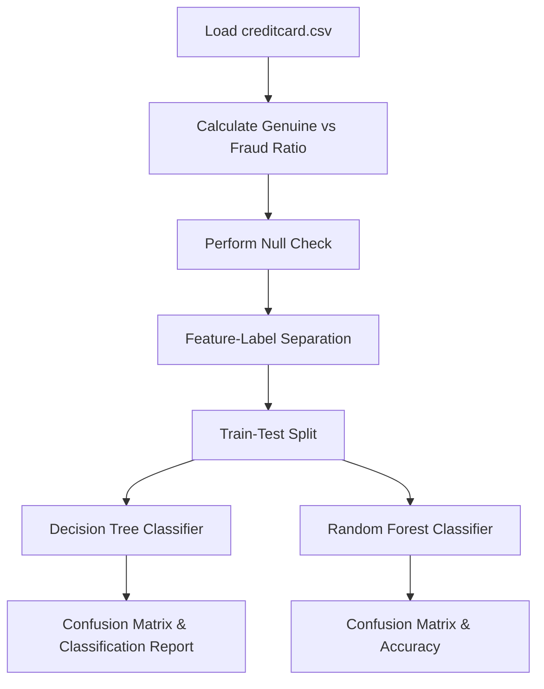

# Credit Card Fraud Detection

[](https://www.python.org/)
[](https://scikit-learn.org/)
[](https://pandas.pydata.org/)

A machine learning classification project implementing **Decision Trees** and **Random Forests** to identify fraudulent credit card transactions within highly imbalanced datasets.

---

## 📌 Project Overview
Credit card fraud detection is a classic imbalanced classification problem. In typical datasets, fraud transactions make up a tiny fraction (< 0.2%) of all transactions. This project details calculation of class ratios, handling null values, split training, and model comparison.



---

## 📐 Imbalanced Classification Metrics

For highly skewed datasets, simple **Accuracy** can be misleading (a naive model predicting "not fraud" always achieves >99% accuracy). Therefore, we focus on **Precision**, **Recall**, and **F1-Score**:

### Precision
Measures the accuracy of positive predictions (minimizing False Positives):

$$\text{Precision} = \frac{TP}{TP + FP}$$

### Recall (Sensitivity)
Measures the proportion of actual fraud transactions detected (minimizing False Negatives):

$$\text{Recall} = \frac{TP}{TP + FN}$$

### F1-Score
The harmonic mean of Precision and Recall:

$$\text{F1-Score} = 2 \cdot \frac{\text{Precision} \cdot \text{Recall}}{\text{Precision} + \text{Recall}}$$

---

## ⚙️ Model Configurations
1. **Decision Tree Classifier**: Default parameters, random state 42. Evaluated using classification report.
2. **Random Forest Classifier**: Built using `n_estimators=50` and random state 42. Evaluated using confusion matrix and accuracy score.

---

## 🛠️ Requirements
To run this notebook, install:
```bash
pip install numpy pandas matplotlib seaborn scikit-learn
```

---

## 🚀 How to Run
1. Place `creditcard.csv` in the project directory.
2. Open and run `project(creditCard_Fraud_Detection).ipynb`.
